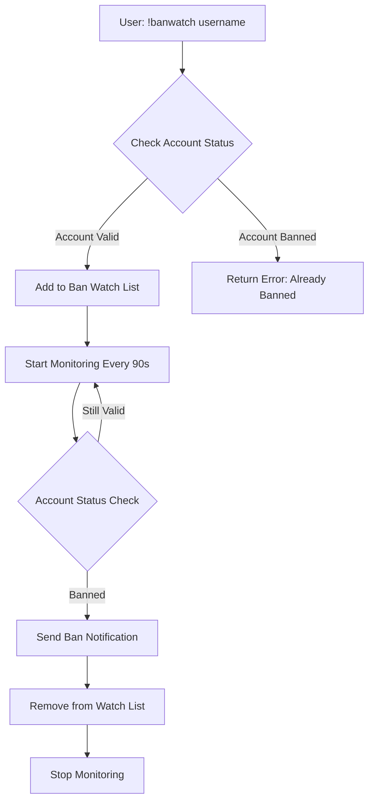
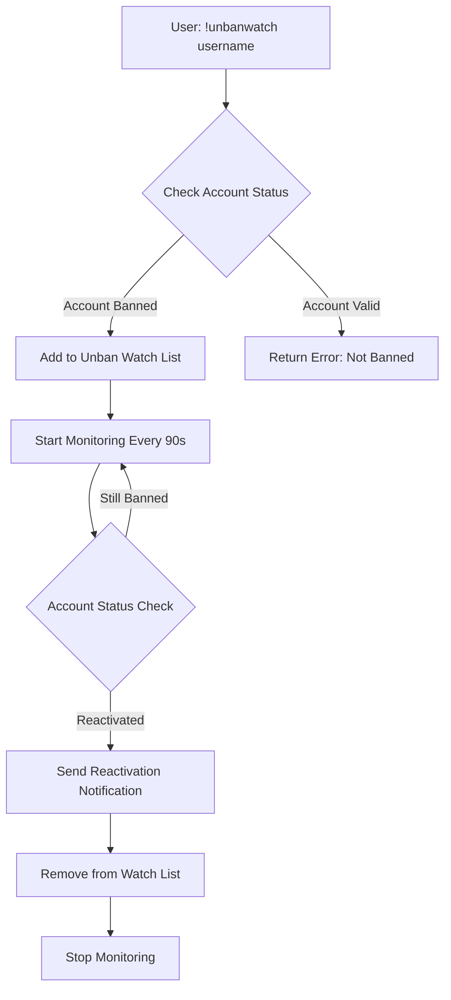
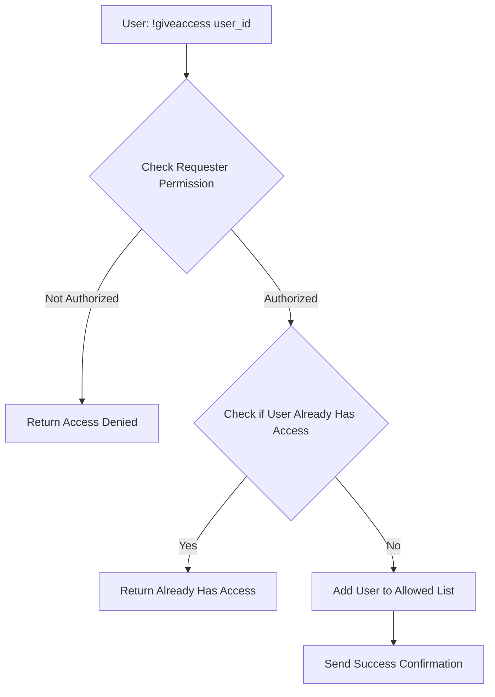
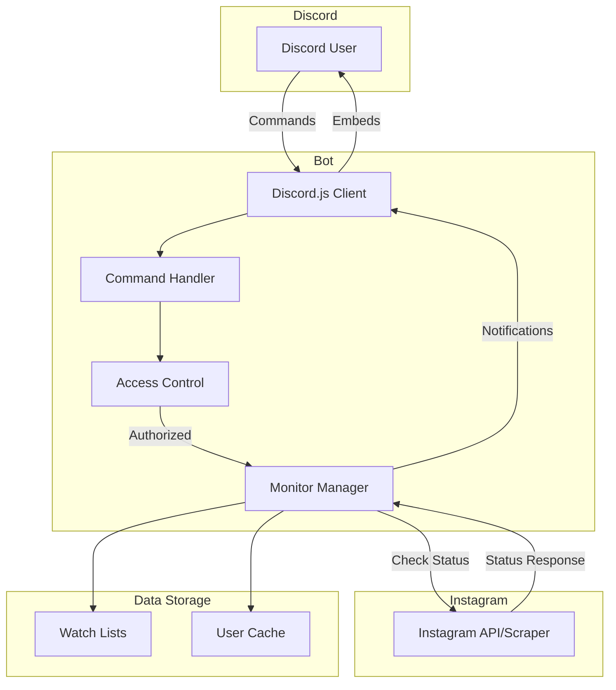
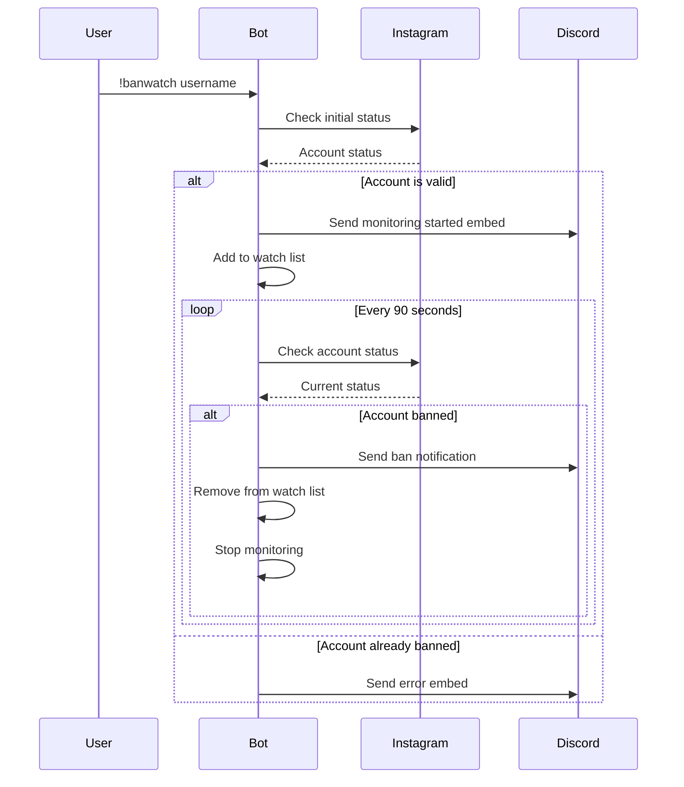

# Instagram Monitor Discord Bot

A Discord bot that monitors Instagram accounts for ban and unban status changes. Get real-time notifications when an Instagram account gets banned or reactivated.

## Features

- **Ban Monitoring**: Track Instagram accounts and get notified when they get banned
- **Unban Monitoring**: Monitor banned accounts and get alerted when they're reactivated
- **Real-time Updates**: Continuous monitoring with 90-second check intervals
- **Access Control**: Manage who can use the bot with user ID whitelisting
- **Watch Lists**: View all currently monitored accounts
- **Rich Embeds**: Beautiful Discord embed notifications with timestamps
- **Error Handling**: Comprehensive error handling with DM notifications

## Table of Contents

- [Installation](#installation)
- [Configuration](#configuration)
- [Commands](#commands)
- [Workflow](#workflow)
- [Project Structure](#project-structure)
- [Contributing](#contributing)
- [License](#license)

## Installation

### Prerequisites

- Node.js v16.9.0 or higher
- npm or yarn
- A Discord Bot Token
- Discord.js v14+

### Setup Steps

1. **Clone the repository**
   ```bash
   git clone https://github.com/7ttp/ig-monitor.git
   cd ig-monitor
   ```

2. **Install dependencies**
   ```bash
   npm install
   ```

3. **Configure environment variables**
   - Copy `.env.example` to `.env`
   ```bash
   cp .env.example .env
   ```
   - Edit `.env` and add your Discord bot token and allowed user IDs:
   ```env
   DISCORD_TOKEN=your_actual_discord_bot_token
   ALLOWED_USER_IDS=your_user_id_1,your_user_id_2
   CHECK_INTERVAL=90000
   ```

4. **Run the bot**
   ```bash
   npm start
   ```

## Configuration

### Environment Variables

All configuration is done through environment variables in the `.env` file:

- **DISCORD_TOKEN**: Your Discord bot token (required)
- **ALLOWED_USER_IDS**: Comma-separated list of Discord user IDs who can use the bot
- **CHECK_INTERVAL**: Time between checks in milliseconds (default: 90000 = 90 seconds)

**Example `.env` file:**
```env
DISCORD_TOKEN=your_actual_discord_bot_token_here
ALLOWED_USER_IDS=1234567890,0987654321
CHECK_INTERVAL=90000
```

### Bot Intents

Required Discord Gateway Intents:
- `Guilds`
- `GuildMessages`
- `MessageContent`
- `DirectMessages`

## Commands

| Command | Description | Usage | Access |
|---------|-------------|-------|--------|
| `!banwatch` | Monitor an Instagram account for bans | `!banwatch <username>` | All allowed users |
| `!unbanwatch` | Monitor a banned account for reactivation | `!unbanwatch <username>` | All allowed users |
| `!banlist` | View all accounts being monitored for bans | `!banlist` | All allowed users |
| `!unbanlist` | View all accounts being monitored for unbans | `!unbanlist` | All allowed users |
| `!giveaccess` | Grant bot access to a new user | `!giveaccess <user_id>` | Admin only |
| `!help` | Display help message with all commands | `!help` | All users |
| `!fake` | Generate a test embed (demo purposes) | `!fake` | All allowed users |

## Workflow

### Ban Watch Workflow



### Unban Watch Workflow



### Access Control Workflow



### Overall System Architecture



### Monitoring Loop Process



## Project Structure

```
ig-monitor/
├── index.js           # Main bot file
├── package.json       # Dependencies and scripts
├── README.md          # This file
└── .gitignore        # Git ignore file
```

## How It Works

### Account Status Detection

The bot checks Instagram account status by:
1. Fetching the Instagram profile page
2. Parsing the `og:description` meta tag
3. Analyzing the description length to determine ban status
   - Length = 3: Account is banned
   - Length > 3: Account is active

### Monitoring System

- **Interval**: Checks every 90 seconds
- **Concurrency**: Multiple accounts can be monitored simultaneously
- **State Management**: Uses `watchedAccounts` object and separate ban/unban watch lists
- **Automatic Cleanup**: Removes accounts from watch lists after status change detected

## Security Considerations

**Important Security Notes:**

1. **Never commit your bot token** - The token in the code should be replaced with environment variables
2. **Use environment variables** for sensitive data:
   ```javascript
   const TOKEN = process.env.DISCORD_TOKEN;
   ```
3. **Implement rate limiting** to prevent Instagram from blocking requests
4. **Regular token rotation** is recommended for production use

## Error Handling

The bot includes comprehensive error handling:
- Command validation
- Permission checks
- API error handling
- DM notifications for errors
- Console logging for debugging

## Features in Detail

### Rich Embeds
All notifications use Discord's rich embed system with:
- Color coding (Black: #000000, Red: #FF0000, etc.)
- Timestamps
- Author information
- Footer branding
- Animated GIFs for visual feedback

### Caching
The bot maintains caches for:
- Ban status (`bancache`)
- Unban status (`unbancache`)
- Follower data (`storedFollowerData`)

## Contributing

Contributions are welcome! Please follow these steps:

1. Fork the repository
2. Create a feature branch (`git checkout -b feature/AmazingFeature`)
3. Commit your changes (`git commit -m 'Add some AmazingFeature'`)
4. Push to the branch (`git push origin feature/AmazingFeature`)
5. Open a Pull Request

## License

This project is licensed under the MIT License - see the [LICENSE](LICENSE) file for details.

## Acknowledgments

- [Discord.js](https://discord.js.org/) - Discord API wrapper
- [Instagram](https://instagram.com) - Profile data source

## Support

For support, please open an issue in the GitHub repository or contact the maintainers.

## Disclaimer

This bot is for educational purposes only. Please respect Instagram's Terms of Service and rate limits. The developers are not responsible for any misuse of this software.

---

Made by Vaibhav(7ttp)
